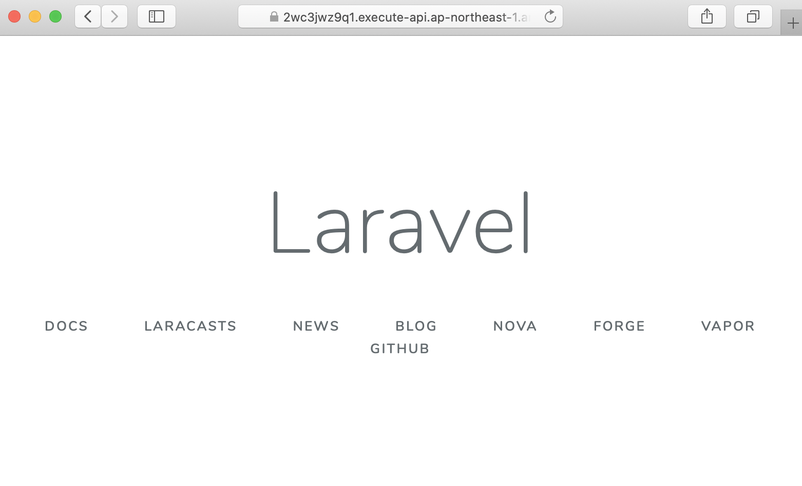

[](https://badge.fury.io/js/cdk-serverless-lamp)
[](https://badge.fury.io/py/cdk-serverless-lamp)


# Welcome to cdk-serverless-lamp

`cdk-serverless-lamp` is a JSII construct library for AWS CDK that allows you to deploy the [New Serverless LAMP Stack](https://aws.amazon.com/tw/blogs/compute/introducing-the-new-serverless-lamp-stack/) by specifying the local `laravel` directory.

By deploying this stack, it creates the following resources for you:

1. Amazon API Gateway HTTP API
2. AWS Lambda custom runtime with [Bref runtime](https://bref.sh/docs/runtimes/) support
3. [WIP] Amazon Aurora for MySQL database with RDS proxy enabled

## Usage

```ts
import { ServerlessApi } from 'cdk-serverless-lamp';

// create a serverless Laraval with custom `brefLayerVersion`
new ServerlessApi(stack, 'testing', {
  brefLayerVersion: 'arn:aws:lambda:ap-northeast-1:209497400698:layer:php-74-fpm:11',
});
```

On deploy complete, the API Gateway URL will be returned in the Output. Click the URL and you will see the Laravel landing page:




## Prepare the Laravel and bref

```bash
$ git clone https://github.com/pahud/cdk-serverless-lamp.git
$ cd cdk-serverless-lamp
$ mkdir composer && cd composer
# create a laravel project
$ docker run --rm -ti \
  --volume $PWD:/app \
  composer create-project laravel/laravel laravel58-bref --prefer-dist
# enter this project
$ cd laravel58-bref
# install bref in the vendor
$ docker run --rm -ti \
  --volume $PWD:/app \
  composer require bref/bref
```


## Configure Laravel with Bref for Lambda

According to the Bref [document](https://bref.sh/docs/frameworks/laravel.html), we need configure the environment before it can be deployed on Lambda:

edit the `.env` file
```
VIEW_COMPILED_PATH=/tmp/storage/framework/views

# We cannot store sessions to disk: if you don't need sessions (e.g. API) then use `array`
# If you write a website, use `cookie` or store sessions in database.
SESSION_DRIVER=cookie

# Logging to stderr allows the logs to end up in Cloudwatch
LOG_CHANNEL=stderr
```

edit the `app/Providers/AppServiceProvider.php`

```php
    public function boot()
    {
        // Make sure the directory for compiled views exist
        if (! is_dir(config('view.compiled'))) {
            mkdir(config('view.compiled'), 0755, true);
        }
    }
```

edit `bootstrap/app.php`

```php

$app = new Illuminate\Foundation\Application(
    $_ENV['APP_BASE_PATH'] ?? dirname(__DIR__)
);

// add the following statement
// we will configure APP_STORAGE = '/tmp' in Lambda env var
$app->useStoragePath($_ENV['APP_STORAGE'] ?? $app->storagePath());
```
_(credit to [@azole](https://medium.com/@azole/deploy-serverless-laravel-by-bref-6f28b1e0d53a))_


## TODO

- Add Aurora for MySQL stack 
- Add RDS proxy support


